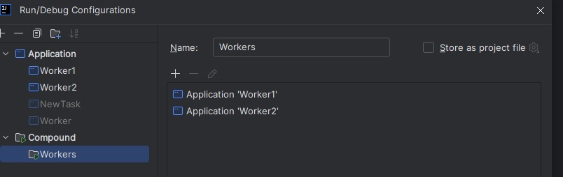
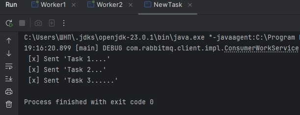
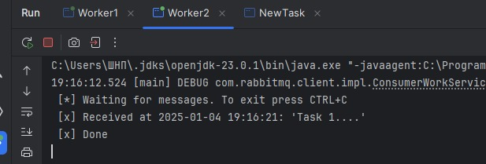
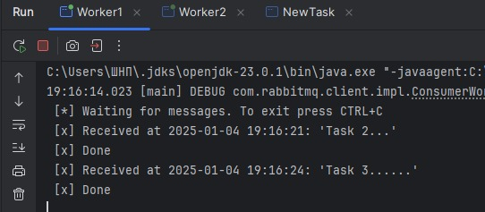
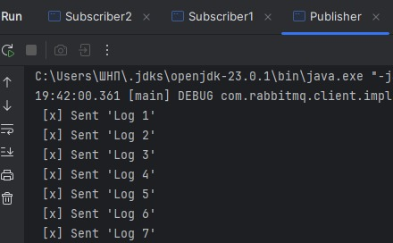
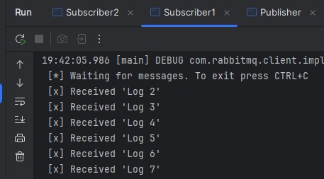
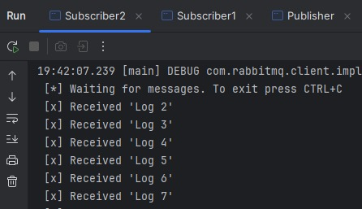
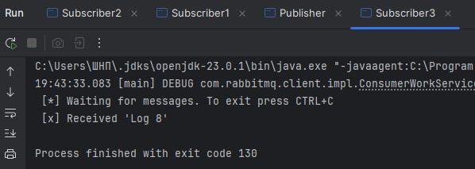

# Практическая работа - RabbitMQ

## Задача 1. Реализация очереди задач (Task Queue)

### Описание:
Создайте приложение на Java, которое демонстрирует использование очереди задач. Приложение должно состоять из
двух компонентов: 

* Производитель (Producer): отправляет задачи в очередь RabbitMQ. 
* Потребитель (Consumer): получает задачи из очереди и обрабатывает их.

### Шаги:

Создадим класс NewTask (Producer):

```Java
package org.example;

import com.rabbitmq.client.Channel;
import com.rabbitmq.client.Connection;
import com.rabbitmq.client.ConnectionFactory;
import com.rabbitmq.client.MessageProperties;

public class NewTask {

    private static final String TASK_QUEUE_NAME = "task_queue";

    public static void main(String[] argv) throws Exception {
        ConnectionFactory factory = new ConnectionFactory();
        factory.setHost("localhost");
        try (Connection connection = factory.newConnection();
             Channel channel = connection.createChannel()) {
            channel.queueDeclare(TASK_QUEUE_NAME, true, false, false, null);

            String[] messages = {"Task 1....", "Task 2...", "Task 3......"};

            for (String message : messages) {
                channel.basicPublish("", TASK_QUEUE_NAME,
                        MessageProperties.PERSISTENT_TEXT_PLAIN,
                        message.getBytes("UTF-8"));
                System.out.println(" [x] Sent '" + message + "'");
            }
        }
    }
}
```

Он создаст очередь из 3 задач, каждая точка означает время выполнение данной задачи 1 точка = 1 секунде.


Далее создадим класс Worker (Consumer), который будет принимать задачи из очереди и "выполнять их":

```Java
package org.example;

import com.rabbitmq.client.Channel;
import com.rabbitmq.client.Connection;
import com.rabbitmq.client.ConnectionFactory;
import com.rabbitmq.client.DeliverCallback;

import java.time.LocalDateTime;
import java.time.format.DateTimeFormatter;

public class Worker {

    private static final String TASK_QUEUE_NAME = "task_queue";

    public static void main(String[] argv) throws Exception {
        ConnectionFactory factory = new ConnectionFactory();
        factory.setHost("localhost");
        final Connection connection = factory.newConnection();
        final Channel channel = connection.createChannel();

        channel.queueDeclare(TASK_QUEUE_NAME, true, false, false, null);
        System.out.println(" [*] Waiting for messages. To exit press CTRL+C");

        channel.basicQos(1);

        DeliverCallback deliverCallback = (consumerTag, delivery) -> {
            String message = new String(delivery.getBody(), "UTF-8");

            
            String currentTime = LocalDateTime.now().format(DateTimeFormatter.ofPattern("yyyy-MM-dd HH:mm:ss"));

            System.out.println(" [x] Received at " + currentTime + ": '" + message + "'");
            try {
                doWork(message);
            } finally {
                System.out.println(" [x] Done");
                channel.basicAck(delivery.getEnvelope().getDeliveryTag(), false);
            }
        };

        channel.basicConsume(TASK_QUEUE_NAME, false, deliverCallback, consumerTag -> { });
    }

    private static void doWork(String task) {
        for (char ch : task.toCharArray()) {
            if (ch == '.') {
                try {
                    Thread.sleep(1000);
                } catch (InterruptedException _ignored) {
                    Thread.currentThread().interrupt();
                }
            }
        }
    }
}
```

### Пример работа:
1. Создаем конфигурацию для запуска нескольких Consumer сразу:
   
2. Запускаем Consumer и Producer: 
   
   
   
   


## Задача 2. Реализация системы публикации/подписки (Publish/Subscribe)

### Описание
Разработайте систему уведомлений, где одно приложение публикует сообщения, а несколько приложений подписываются на получение этих сообщений. Это модель полезна для рассылки событий или оповещений в реальном времени.

### Требования
* Использование обменника: применить fanout обменник (exchange) для широковещательной рассылки.
* Подписчики: каждый подписчик должен получать копию каждого сообщения.
* Устойчивость очередей: очереди подписчиков должны быть устойчивыми и не удаляться при перезапуске
RabbitMQ.
* Динамическое добавление подписчиков: новые подписчики могут подключаться в любой момент и начинать
получать сообщения.

### Шаги:
1. Создадим класс Publisher:
 ```Java
package org.example;

import com.rabbitmq.client.Channel;
import com.rabbitmq.client.Connection;
import com.rabbitmq.client.ConnectionFactory;

public class Publisher {
    private static final String EXCHANGE_NAME = "logs";

    public static void main(String[] args) throws Exception {
        ConnectionFactory factory = new ConnectionFactory();
        factory.setHost("localhost");

        try (Connection connection = factory.newConnection();
             Channel channel = connection.createChannel()) {

            channel.exchangeDeclare(EXCHANGE_NAME, "fanout");

            int messageCount = 1;  // Счётчик сообщений
            while (true) {
                String message = "Log " + messageCount++;

                channel.basicPublish(EXCHANGE_NAME, "", null, message.getBytes("UTF-8"));
                System.out.println(" [x] Sent '" + message + "'");


                Thread.sleep(15000);
            }
        }
    }
}
```
2. Создадим класс Subscriber:
```Java
package org.example;

import com.rabbitmq.client.Channel;
import com.rabbitmq.client.Connection;
import com.rabbitmq.client.ConnectionFactory;
import com.rabbitmq.client.DeliverCallback;

public class Subscriber {
    private static final String EXCHANGE_NAME = "logs";

    public static void main(String[] argv) throws Exception {
        ConnectionFactory factory = new ConnectionFactory();
        factory.setHost("localhost");
        try (Connection connection = factory.newConnection();
             Channel channel = connection.createChannel()) {

            channel.exchangeDeclare(EXCHANGE_NAME, "fanout");

            String queueName = channel.queueDeclare().getQueue();

            channel.queueBind(queueName, EXCHANGE_NAME, "");

            System.out.println(" [*] Waiting for messages. To exit press CTRL+C");

            DeliverCallback deliverCallback = (consumerTag, delivery) -> {
                String message = new String(delivery.getBody(), "UTF-8");
                System.out.println(" [x] Received '" + message + "'");
            };

            channel.basicConsume(queueName, true, deliverCallback, consumerTag -> {});
            
            Thread.currentThread().join();
        }
    }
}

```
3. Запускаем Publisher и 2 Subcriber:

    
   
    
   
     

4. Запускаем 3-го Subcsriber: 
   
     
